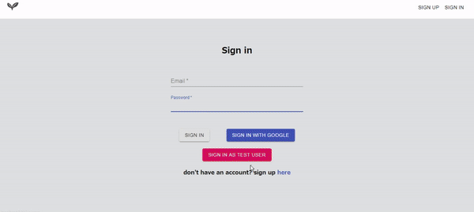

## A Personal Project with React

### "Making your own Top 10 lists"

This application was built using create-react-app as a base, and the technologies used were React (Custom Hooks, Context), Firebase (Autentication, Cloud Firestore, Hosting) & Material UI.

## Demo

Url Link : [https://project-9fe3c.web.app/signin](https://project-9fe3c.web.app/signin)

## Description

You can search contents by title. For finding books and manga, you have to type Japanese but other genres accepts English search words. Following is the list of API that I use for searching data:

Moive Search API (Movie, Anime and TV Series): [The Movie Database (TMDb)](https://developers.themoviedb.org/3/search/search-movies)

Books Search API (Manga and Book): [Rakuten Books Book Search API](https://webservice.rakuten.co.jp/api/booksbooksearch/)

Music Search API : [iTunes Search API](https://affiliate.itunes.apple.com/resources/documentation/itunes-store-web-service-search-api/)
